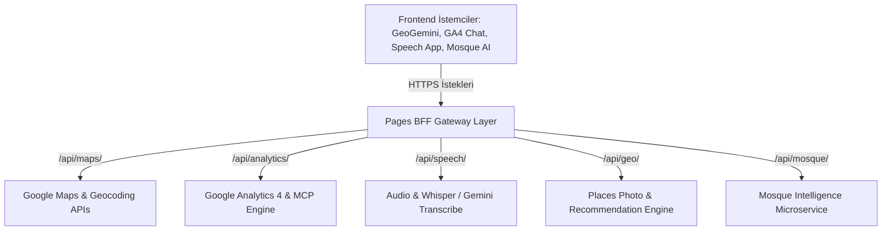

# ⚡ Pages BFF - Unified Backend-for-Frontend API Gateway

[](https://www.typescriptlang.org/)
[](https://nextjs.org/)
[](https://microservices.io/patterns/apigateway.html)
[](https://deepmind.google/technologies/gemini/)
[](https://www.yucelgumus.dev/)

> Birden fazla frontend web ve mobil uygulamasının (Harita, Analitik, Ses, Doküman, Cami Rehberi vb.) arka uç mikroservislerine ve yapay zeka sağlayıcılarına tek ve güvenli bir noktadan bağlanmasını sağlayan **Next.js 15 tabanlı Backend-For-Frontend (BFF) API Ağ Geçidi**.

---

## 🌟 Öne Çıkan Özellikler

- 🛡️ **Merkezi Güvenlik & Proxy Ağ Geçidi:** İstemcilerin doğrudan API anahtarlarını (Google Gemini, Google Maps, GA4) görmesini engelleyen güvenli sunucu tarafı proxy katmanı (`lib/gateway.ts`).
- 🗺️ **Mekansal & Harita Servisleri API:** Google Maps API proxy'si (`/api/maps/proxy`), yer önerisi (`/api/geo/recommend-place`) ve yüksek çözünürlüklü mekan fotoğrafları.
- 📊 **Google Analytics & MCP Gateway:** GA4 verilerini doğal dilde sorgulayan mikroservislerle ön uç arasındaki iletişim köprüsü (`/api/analytics/ask`).
- 🎙️ **Ses İşleme & Transkripsiyon:** Ses kayıtlarını metne çeviren (`/api/speech/transcribe`) ve Gemini ile metinleri düzelten/özetleyen (`/api/speech/polish`) API hattı.
- 🕌 **Kültürel & Mekansal Zeka:** Cami ve tarihi mekan sohbet ve görsel servisleri (`/api/mosque/chat`, `/api/mosque/photo`).
- ⚡ **Düşük Gecikme (Low Latency) & Edge Desteği:** Vercel ve Edge Runtime ile optimize edilmiş yanıt süreleri.

---

## 🏗️ Mimari & API Rotaları



---

## 📡 API Endpoint Referansı

| Endpoint | Metot | Açıklama |
| :--- | :--- | :--- |
| `/api/maps/proxy/[...path]` | `GET / POST` | Harita tile ve Google Maps API güvenli proxy |
| `/api/maps/chat` | `POST` | Harita rota ve mekan asistanı sohbeti |
| `/api/analytics/ask` | `POST` | GA4 analitik sorgulama ağ geçidi |
| `/api/geo/places/photo` | `GET` | Google Places görsel çekme servisi |
| `/api/geo/recommend-place` | `POST` | Yapay zeka destekli mekan önerisi |
| `/api/speech/transcribe` | `POST` | Ses dosyasını metne dönüştürme |
| `/api/speech/polish` | `POST` | Transkripsiyon metnini yapay zeka ile düzeltme |
| `/api/mosque/chat` | `POST` | Cami mimarisi ve tarihi hakkında AI sohbeti |

---

## 🚀 Hızlı Başlangıç

### Gereksinimler
- **Node.js**: v18.18+ veya v20+
- Gerekli API anahtarları (Google AI Studio, Google Maps API)

### Kurulum

```bash
git clone https://github.com/yucel-gumus/pages-bff.git
cd pages-bff

npm install
```

### Ortam Değişkenleri (`.env.local`)

```env
GEMINI_API_KEY=your_gemini_api_key
GOOGLE_MAPS_API_KEY=your_google_maps_api_key
PYTHON_BACKEND_URL=https://your-backend-service-url.run.app
```

### Çalıştırma

```bash
npm run dev
```

---

## 📂 Proje Dizin Yapısı

```
pages-bff/
├── package.json
├── tsconfig.json
├── next.config.ts
├── app/
│   ├── layout.tsx
│   ├── page.tsx
│   └── api/
│       ├── maps/                   # Harita ve rota proxy API'leri
│       ├── geo/                    # Mekan fotoğrafları ve öneriler
│       ├── analytics/              # Analitik ve MCP köprüsü
│       ├── speech/                 # Ses işleme ve metin düzeltme
│       └── mosque/                 # Cami rehber servisleri
└── lib/
    └── gateway.ts                  # Merkezi API istek yönlendiricisi
```

---

## 📄 Lisans
Bu proje [MIT Lisansı](LICENSE) ile lisanslanmıştır.

---

## 👨‍💻 Geliştirici & İletişim

**Yücel Gümüş** - Full Stack Developer

- 🌐 **Web Sitesi / Portfolyo:** [yucelgumus.dev](https://www.yucelgumus.dev/)
- 💼 **LinkedIn:** [linkedin.com/in/yucel-gumus](https://www.linkedin.com/in/yucel-gumus/)
- 🐙 **GitHub:** [@yucel-gumus](https://github.com/yucel-gumus)

<p align="left">
  <a href="https://www.yucelgumus.dev/" target="_blank" rel="noopener noreferrer">
    
  </a>
</p>